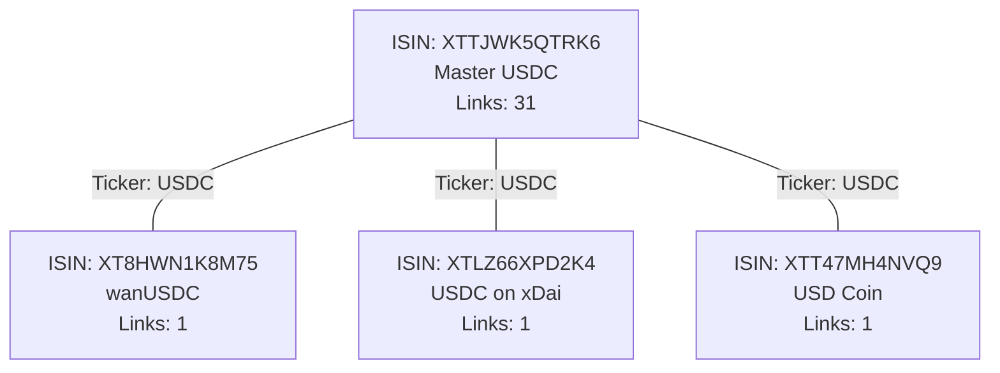

# Crypto Identity Manifest

This document describes the data source, structure, and automated ingestion process used to maintain the canonical identity manifest for digital assets (cryptocurrencies).

## 1. Data Source
The primary source of truth for digital asset identities is the **ANNA Service Bureau (ASB)** in partnership with the **Digital Token Identifier Foundation (DTIF)**.

*   **Standards**: It maps **ISO 6166 (ISIN)** identifiers to **ISO 24165 (DTI)** implementation identifiers.
*   **Scope**: Covers native protocol tokens (e.g., BTC), wrapped/bridged versions (e.g., WBTC), and technical implementations across multiple ledgers.

## 2. Raw Data Available
The ingestion script processes a dated CSV from ANNA containing the following key columns:

| Column | Description |
| :--- | :--- |
| **ISIN** | International Securities Identification Number. Identifies the **Financial Instrument** (The Asset). |
| **DTI** | Digital Token Identifier. Identifies the **Token Implementation** (The Technical Rail). |
| **FISN** | Financial Instrument Short Name. Usually follows `NAME/TICKER` or `NAME ON NETWORK/TICKER`. |
| **DTI Long Name** | The official name assigned to the identifier. |
| **DTI Short Name** | Ticker symbols (often semicolon-separated aliases like `BTC;XBT`). |
| **DTI Status** | `Validated` (authoritative) or `Provisional` (assigned but pending). |
| **Linked DTI(s)** | A list of implementation DTIs that share the same underlying asset. |
| **Added Date** | The date the record was first registered. |

---

## 3. The Ingestion Algorithm
To create a clean, collision-free manifest for the `quasar` matching engine, the `scripts/ingest_anna_crypto.py` script performs a multi-stage "Noise-Reduction" process.

### Step 0: Pre-Filtering
We filter the 2,600+ raw records down to only tradeable referential instruments.
*   **Type Filter**: Only `Referential Instrument` (excludes digital bonds and private equity).
*   **CFI Filter**: Only `TMXXXX` (the ISO standard for crypto tokens).
*   **Privacy Filter**: Excludes `Private` and `Reserved` statuses.

### Step 1: ISIN-Centric Consolidation
Multiple technical DTIs often share the same ISIN. We group by **ISIN** to merge these implementations into unique instruments.
*   **Aggregation**: All unique aliases from the group are collected.
*   **Identity**: We pick the most descriptive name based on the record with the most links.

### Step 2: Asset-Name Consolidation
We group the remaining instruments by **(Primary Ticker + Name)** to identify cases where different ISINs represent the same real-world asset (e.g., multiple "BNB" registrations).

### Step 3: Any-Symbol Overlap Pruning (The "Bouncer")
This is the final safeguard to ensure a **one-to-one mapping** between a symbol and an identity.
1.  **Graph Construction**: The script builds a graph of records that share *any* symbol in their alias list.
2.  **Canonical Selection**: Within each cluster (e.g., all 56 records claiming the `USDC` ticker), we pick a single **Master Winner** using tiered priority:
    *   **Tier 1**: `Validated` status + Highest Link Count (The FFG Master).
    *   **Tier 2**: Earliest `Added Date` (Seniority/Original Native Asset).
3.  **Strict Isolation**: Only the **winner's** data (ISIN, Name, and Symbols) survives. This prevents technical implementation tickers (like `wanUSDC`) from polluting canonical master records.

---

## 4. Visualizing the Logic: The USDC Case
The transition from raw data to a clean manifest is most apparent with a highly-bridged asset like USDC.

### Raw Data (Conceptual Graph)


### Manifest Result
The "Bouncer" identifies that all these records compete for the `USDC` symbol. The Master record (A) wins because it is **Validated** and has the **highest link count**.

```yaml
- isin: XTTJWK5QTRK6
  symbol: USDC
  name: USDC
  exchange: null
```

---

## 5. Summary of Results
| Phase | Record Count | Quality |
| :--- | :--- | :--- |
| **Raw CSV** | 2,612 | High Noise (Technical implementaitons) |
| **Intermediate (Step 1)** | 2,274 | Unique Instruments (ISIN-based) |
| **Final Manifest** | **1,534** | **Unique Financial Assets (Matcher-Ready)** |

**Key Feature**: Every symbol in the manifest is guaranteed to appear in **exactly one** record, ensuring zero ambiguity for the matching engine.

